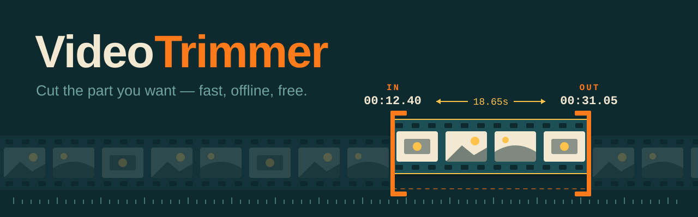
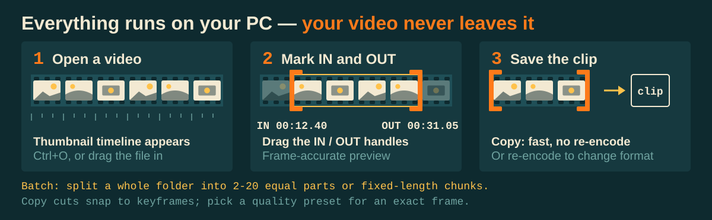
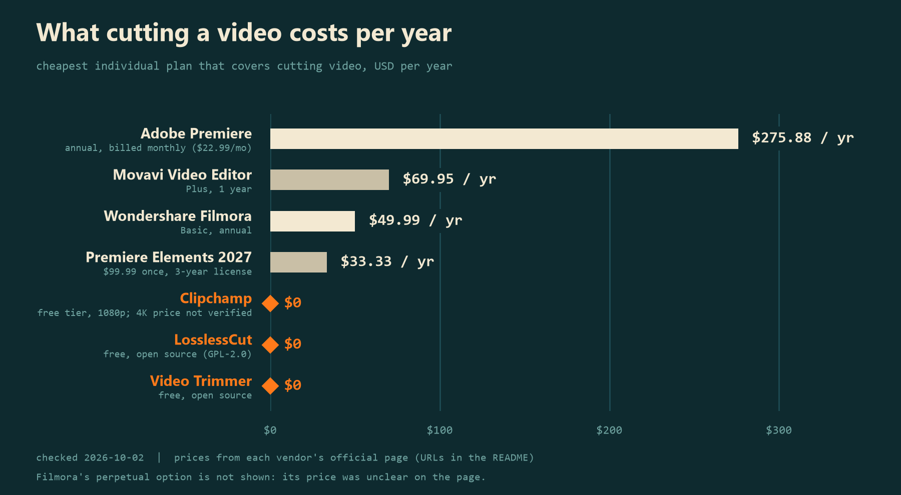

<p align="center">
  
</p>

# Video Trimmer

**Cut the part you want out of any video: fast, offline, free.**

Open a video, drag two handles on a thumbnail timeline to mark where the clip starts and ends, press export. Nothing is uploaded, there is no account, and you do not need to install ffmpeg.

[**Download for Windows**](https://github.com/awesomo913/video-trimmer/releases/latest)

[](https://github.com/awesomo913/video-trimmer/actions/workflows/ci.yml)
[](LICENSE)


## Why Video Trimmer

- **Does one job.** Pull 30 seconds out of a two-hour recording without opening a full video editor.
- **Fast when it can be.** The default "Copy" export does not re-encode, so a trim takes about a second and loses no quality.
- **Private.** Your videos never leave your computer. No account, no telemetry, no network access.
- **Nothing to install.** ffmpeg comes inside the app.
- **Batch split.** Point it at a folder and cut every video into 2 to 20 equal parts, or into chunks of a set length (handy when an upload or an AI tool has a size or time limit).
- **Free and open source.** MIT licensed. No watermark, no export limit, no upsell.

## Quick start

1. [Download the latest release](https://github.com/awesomo913/video-trimmer/releases/latest) and run `VideoTrimmer.exe`.
2. Open a video (`Ctrl+O`, or drag the file onto the window).
3. Press `[` where the clip should start and `]` where it should end. You can also drag the green and red handles, or type a time.
4. Press `Ctrl+E`, choose a format and quality, and pick where to save. The original is never changed.

| Key | Action |
|---|---|
| `Space` | Play / pause (playback stops at your end point) |
| `Left` / `Right` | Step one frame |
| `Shift+Left` / `Shift+Right` | Jump 5 seconds |
| `[` / `]` | Set start / end at the playhead |
| `Ctrl+O` / `Ctrl+E` | Open / export |
| `Ctrl+Shift+S` | Save the current frame as an image |

## How it works

<p align="center">
  
</p>

1. **Preview** uses OpenCV, which can jump to any frame quickly, so the timeline and playhead feel immediate.
2. **Export** hands the cut to ffmpeg. With "Copy" quality it copies the video and audio as they are. With a quality preset (CRF 18 to 35) it re-encodes.
3. Crop, rotate and flip are applied on export (this forces a re-encode of the picture; the audio can still be copied).
4. Progress comes from ffmpeg's own output. If anything fails you see what ffmpeg said, and a half-written file is removed.

## Features

| Feature | Detail |
|---|---|
| Formats in | mp4, mkv, mov, avi, webm, flv, wmv, ts, m4v, mpg, mpeg, 3gp, m2ts, vob, ogv |
| Formats out | MP4, MKV, AVI, WebM, MOV |
| Quality | Copy (lossless, fastest) or re-encode at CRF 18 / 23 / 28 / 35 |
| Timeline | Thumbnail strip, draggable start and end handles, typed times |
| Edits | Crop, rotate 90/180/270, flip |
| Snapshot | Save the current frame as PNG, JPEG or WebP |
| Batch split | Equal parts (2 to 20) or fixed-length chunks, whole folder at once |
| Safe | Never overwrites the source; batch re-runs never overwrite earlier results |

## Comparison

Video Trimmer is a trimmer, not an editor. Prices are the cheapest individual plan that covers cutting video, read from each vendor's official page. **Checked 2026-10-02.**

<p align="center">
  
</p>

| Product | Plan | Price | Source |
|---|---|---|---|
| **Video Trimmer** | n/a | $0 | this project |
| LosslessCut | Free (GPL-2.0); optional paid store builds | $0 on GitHub | [github.com/mifi/lossless-cut](https://github.com/mifi/lossless-cut) |
| Clipchamp | Free tier, up to 1080p export; 4K with Microsoft 365 | $0 (free tier) | [clipchamp.com/en/pricing](https://clipchamp.com/en/pricing/)¹ |
| Adobe Premiere Elements 2027 | One-time, 3-year license | $99.99 (about $33/year) | [adobe.com/products/premiere-elements](https://www.adobe.com/products/premiere-elements.html) |
| Wondershare Filmora | Basic, annual | $49.99/year | [filmora.wondershare.com/pricing](https://filmora.wondershare.com/pricing.html) |
| Movavi Video Editor | Plus, 1 year | $69.95/year | [movavi.com/videoeditor/buy](https://www.movavi.com/videoeditor/buy.html) |
| Adobe Premiere (Pro) | Single app, annual billed monthly | $22.99/month (about $276/year) | [adobe.com/products/premiere](https://www.adobe.com/products/premiere.html) |

¹ The Microsoft 365 price for Clipchamp's paid tier could not be opened when checking (the page timed out), so no figure is given. Filmora also lists a perpetual option; the page text was not clear enough to quote a price. Check the vendor pages before relying on any number.

**LosslessCut is a strong free alternative, and does more than this app** (several segments from one file, many container tricks, other platforms). Choose it if you need those. Video Trimmer is for people who want a smaller, simpler window: one clip, a visual timeline, ready-made quality presets, crop/rotate, and one-click batch splitting of a folder.

## Limitations

- **Windows build.** The release is a Windows `.exe`. The code is plain Python and may run elsewhere, but only Windows is tested (CI runs on Windows).
- **"Copy" cuts snap to keyframes.** Video can only be cut without re-encoding at keyframes, so the start of a copied clip can be up to a second or two earlier than you marked, depending on the video. Pick a quality preset when you need an exact frame.
- **One clip at a time.** There is no multi-track editing and no cutting a section out of the middle.
- **Streams kept:** all video and audio streams. Subtitle and data tracks are dropped.
- **Preview sound needs `ffplay`.** It is not bundled. Without it the preview is silent; exports keep the audio.
- **WebM always re-encodes** (VP9 + Opus), because most sources cannot be copied into WebM.
- **The release `.exe` is large** (about 100 MB) because it contains ffmpeg.
- **The release `.exe` is unsigned.** See the FAQ.

## FAQ

<details>
<summary>Windows says "Windows protected your PC". Is this safe?</summary>

The release `.exe` is not code-signed (certificates cost money for a free open-source project), so SmartScreen warns about unknown publishers. Click **More info, then Run anyway**; compare the download with `SHA256SUMS.txt` on the [release page](https://github.com/awesomo913/video-trimmer/releases/latest); or build it yourself (below).
</details>

<details>
<summary>My antivirus flagged the .exe.</summary>

Programs packed with PyInstaller are often false-positived because malware uses the same packing. If you would rather not trust the prebuilt file, build from source. It is a few commands and every line is readable.
</details>

<details>
<summary>Do I need to install ffmpeg?</summary>

No. A copy of ffmpeg is bundled. (If you have `ffplay` on your PATH the preview will also play sound.)
</details>

<details>
<summary>Does it upload my video anywhere?</summary>

No. It makes no network connections. See [SECURITY.md](SECURITY.md).
</details>

<details>
<summary>Does it change my original file?</summary>

Never. Exports always make a new file, and the app refuses to save over the video you are trimming.
</details>

<details>
<summary>Why is my copied clip a bit longer than I selected?</summary>

"Copy" quality cuts at keyframes (see Limitations). Choose Medium (CRF 23) or another preset for a frame-accurate cut.
</details>

<details>
<summary>Something failed. Where's the log?</summary>

`%LOCALAPPDATA%\VideoTrimmer\logs\app.log` (paste that into `Win+R` to open it). If you report a bug, the last few lines help a lot. They contain file names and ffmpeg messages, never video content.
</details>

## Build from source

Requires Python 3.11.

```bash
git clone https://github.com/awesomo913/video-trimmer.git
cd video-trimmer
uv venv --python 3.11 .venv
uv pip install --python .venv -r requirements.txt
.venv/Scripts/python main.py
```

Build the standalone exe, and run the checks:

```bash
uv pip install --python .venv -r requirements-dev.txt
.venv/Scripts/python build.py        # dist/VideoTrimmer.exe
.venv/Scripts/python -m pytest -q
.venv/Scripts/python -m ruff check .
```

See [TUTORIAL.md](TUTORIAL.md) for a longer walkthrough.

## Contributing

Contributions are welcome. See [CONTRIBUTING.md](CONTRIBUTING.md) for setup, architecture notes and ideas to start with, and the [Code of Conduct](CODE_OF_CONDUCT.md).

If Video Trimmer saves you time, a star helps others find it.

## License

[MIT](LICENSE) © 2026 awesomo913. The bundled ffmpeg is GPLv3 and runs as a separate program; see [THIRD_PARTY.md](THIRD_PARTY.md).

## Publisher

Published by **Revolutionary Designs**.  
GitHub: https://github.com/awesomo913  
Contact: contact@revolutionarydesigns.io  <!-- pii-ok: official brand contact -->
